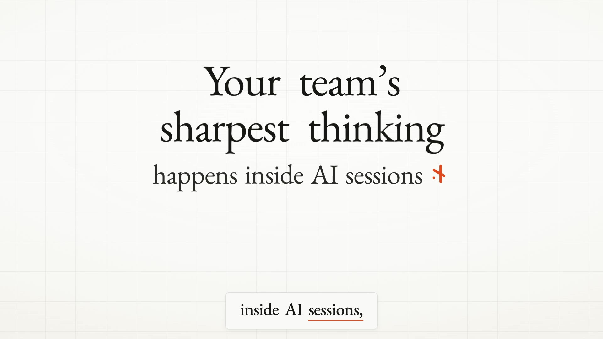

# Context Hub

**The company-wide context hub for the age of AI work.**

Every employee now spends hours a day talking to AI coding assistants — Claude Code, Codex, Kilo Code. Those conversations are the richest, most decision-dense record of how work actually gets done: what was built, why, what was tried, what was decided in a sales or marketing thread. Today that knowledge dies on a laptop in a `.jsonl` file.

Context Hub captures it. A desktop app lets each person **browse, summarize, and curate** their own local AI sessions, then **push** the ones that matter (full transcript or just a high-quality summary) to a company-wide cloud hub. Pushed context merges **like a pull request** — teammates review and approve before it enters the shared index. The hub stores raw sessions in **S3**, indexes them in a **LanceDB** vector store, and powers a single **company-wide RAG agent** — the one agent everyone in the org can ask: *"What did we decide about pricing?"*, *"What's the status of the migration?"*, *"What did the customer in last week's discovery thread actually ask for?"*

This is the [single-agent-per-company](docs/) thesis (à la Shopify's internal agent) — built on the context your team is already generating.

> Read the full **[Market Opportunity](MARKET_OPPORTUNITY.md)** memo.

## The 60-second explainer

[](https://github.com/rajagurunath/freshet/raw/main/apps/web/assets/freshet-explainer.mp4)

**[▶ Watch the explainer (MP4, 67s)](https://github.com/rajagurunath/freshet/raw/main/apps/web/assets/freshet-explainer.mp4)** — how every AI session becomes a local RAG, and how the ones that matter merge — *after teammate review, like a pull request* — into one cited, company-wide brain. Also embedded on the [landing page](apps/web/). Composition source lives in [`videos/freshet-explainer/`](videos/freshet-explainer/) (HyperFrames — re-render with `npx hyperframes render`).

---

## Monorepo layout

```
context-hub/
├── MARKET_OPPORTUNITY.md     # market research & opportunity memo
├── ARCHITECTURE.md           # system design
├── docs/DESIGN.md            # UI design system
├── apps/
│   ├── api/                  # FastAPI central service (S3 + LanceDB + Claude RAG)
│   ├── desktop/              # Tauri 2 + React desktop app (local session manager)
│   └── web/                  # static landing page with the protocol animation
```

## Quick start

### Central API
```bash
cd apps/api
python -m venv .venv && source .venv/bin/activate
pip install -e ".[dev]"
cp .env.example .env          # set ANTHROPIC_API_KEY, S3/AWS, etc. (works locally with no S3)
uvicorn contexthub.main:app --reload --port 8787
```

### Desktop app
```bash
cd apps/desktop
npm install
npm run tauri dev             # native window
# or `npm run dev` for the web UI in a browser
```

### Landing page
```bash
make landing                  # serves apps/web on http://localhost:8788
```
See **[apps/web/README.md](apps/web/README.md)** — pure static HTML/CSS, no build step.

## Supported assistants
| Tool | Source location | Status |
|------|-----------------|--------|
| Claude Code | `~/.claude/projects/**/*.jsonl` | ✅ |
| OpenAI Codex | `~/.codex/sessions/**/rollout-*.jsonl` | ✅ |
| Kilo Code | VS Code `globalStorage/kilocode.kilo-code/tasks/**` | ✅ |
| Cursor / Cline / others | — | 🔜 pluggable parser interface |

## Privacy model
Parsing happens **entirely locally** in the desktop app. Nothing leaves the machine until the user explicitly pushes a session — or opts into auto-sync. Secret-redaction runs before any upload.
